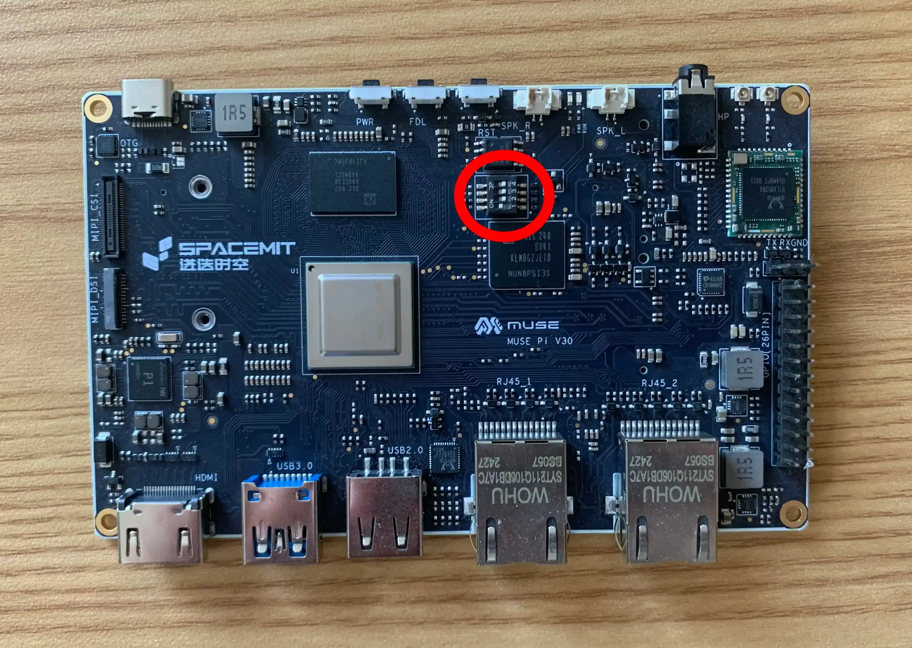
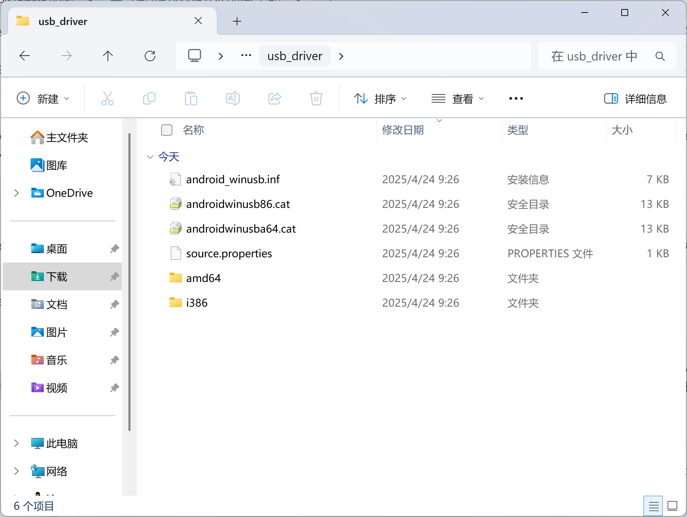
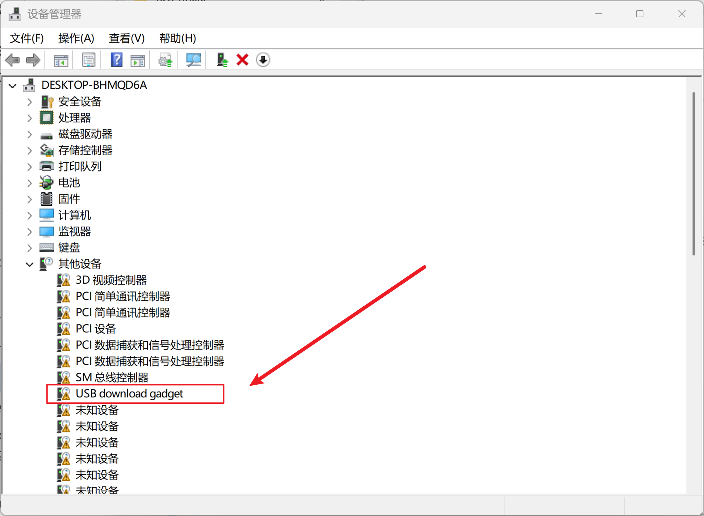
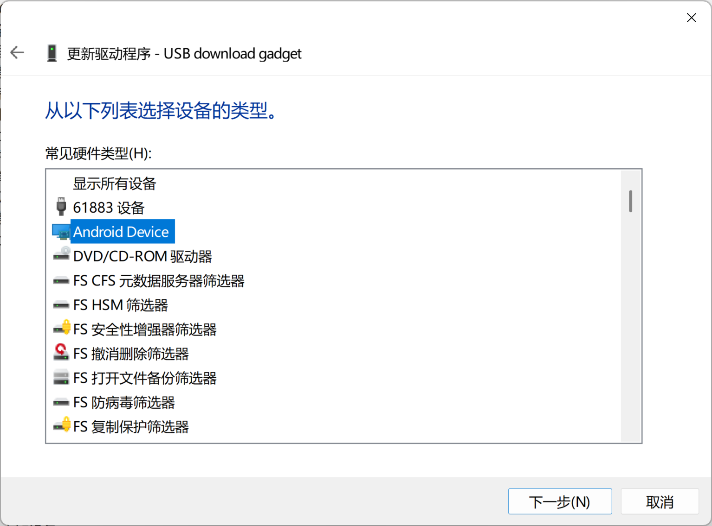
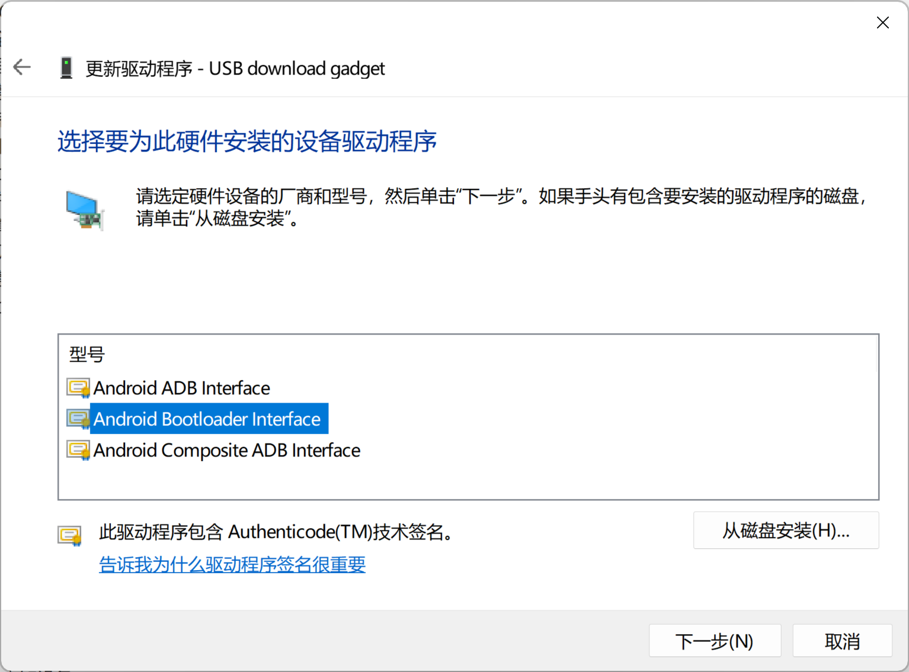
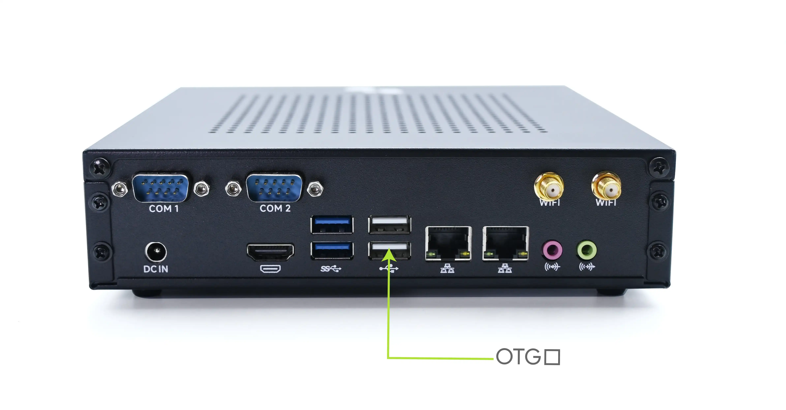
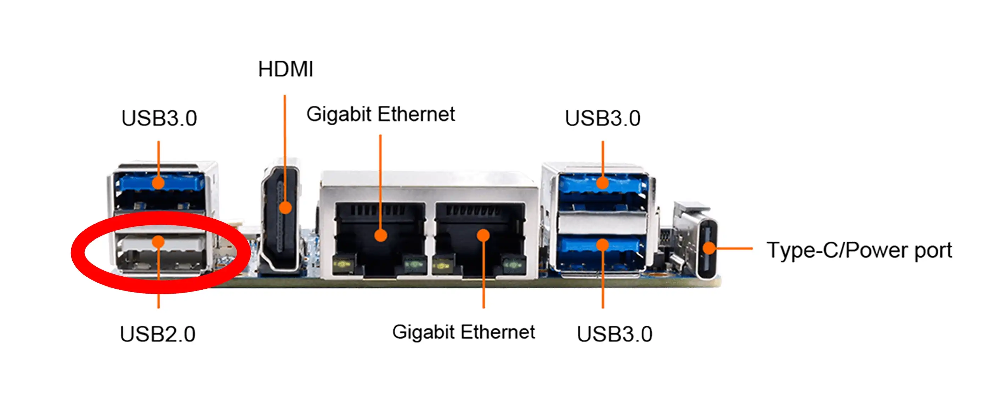
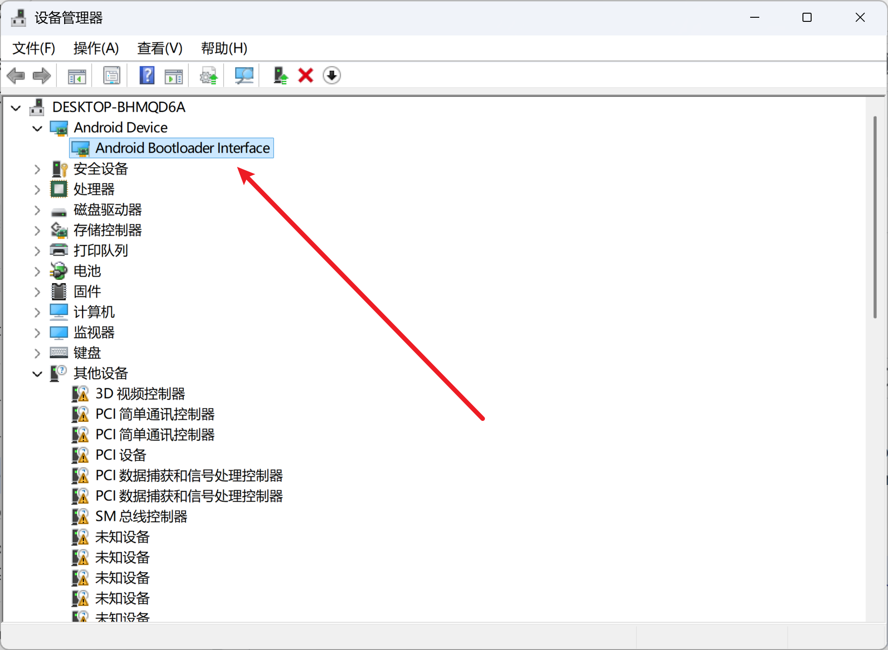

# 基于进迭时空 K1 系列芯片的板卡固件升级方法

下述内容适用于基于进迭时空 K1/M1/X1 芯片的板卡设备。

## 硬件准备

| 板卡 | USB 线缆 | 电源适配器 | 硬件改动 | 启动模式配置 |
| - | - | - | - | - |
| SpacemiT MUSE Pi | Type C 数据线 | 无需 | 无需 | 调节拨码开关 |
| SpacemiT MUSE Card | Type C 数据线 | 无需 | 无需 | 无需 |
| SpacemiT MUSE Box | USB A 口公对公数据线 | 12V 电源 | 无需 | 调节拨码开关 |
| SpacemiT MUSE Pi Pro | Type C 数据线） | 无需 | 无需 | 无需 |
| Milk-V Jupter | Type C 数据线 | 12V 电源 | 无需 | 无需 |
| OrangePi RV2 | USB A 口公对公数据线 | Type C 电源 | 无需 | 无需 |
| BananaPi F3 | Type C 数据线 | 无需 | 补焊一颗 Flash | 调节拨码开关 |

##### 备注

###### USB 线材选择

- 对于需要 Type C 数据线的板卡，A 转 C 或 C 对 C 线材均可使用。
- 对于需要 A 口公对公数据线的板卡，使用 A 转 C 数据线连接电脑的 C 口可能不会工作。

###### 硬件改动

- BananaPi F3 出厂未焊接用于存放固件的 NOR Flash，因此需要补焊一颗，才能支持当前的启动流程。
  - 推荐大小为 8MB (64Mbits) 及以上

###### 启动模式配置

拨码开关需调节至 NOR Flash 启动模式：将 4 位拨码开关的第 1 位拨至 ON 侧：



## 软件准备

参考对应操作系统的 Android 平台命令行工具安装说明。烧录过程需要使用平台工具中的 `fastboot` 工具。

解压固件包需要压缩包管理器支持 Zstd 格式。在 Windows 下推荐使用 [7-Zip](https://www.7-zip.org/)。在 Linux 下需要安装 `tar` 与 `zstd` 工具，具体包名取决于发行版。

### Linux 特定配置

#### 利用 udev rules 解决设备权限问题

##### 操作流程

需确保当前登录用户已在 `plugdev` 组中。

将 K1 芯片的 USB PVID 加入 udev 规则，对设备文件权限进行配置：

```shell
cat << EOF | sudo tee /etc/udev/rules.d/99-spacemit-k1.rules
SUBSYSTEM=="usb", ATTR{idVendor}=="361c", ATTR{idProduct}=="1001", MODE="0660", GROUP="plugdev", TAG+="uaccess"
EOF
```

之后重新将板卡连接至电脑即可生效。

### Windows 驱动配置

第一次阅读请先跳过该步骤。需要完成 [启动板卡至固件刷写模式](#启动板卡至固件刷写模式) 操作后再来继续下述步骤。

#### 获取 Google USB 驱动

前往 [https://developer.android.com/studio/run/win-usb](https://developer.android.com/studio/run/win-usb) 下载 Google USB Driver。

解压得到下图内容：



#### 安装驱动

##### 安装驱动至系统

右键解压得到的 `android_winusb.inf`，点击 `安装` 并根据提示操作。

##### 手动指定驱动程序

打开设备管理器，在 `其它设备` 中找到 `USB download gadget`。



右键该设备，选择 `更新驱动程序` 。在弹出窗口中选择 `浏览我的电脑以查找驱动程序` 。

点击 `让我从计算机上的可用驱动程序列表中选取` 。

在列表中选中 `Android Device` 后点击下一步：



在本页面中，选中 `Android Bootloader Interface` 后点击下一步：



接受弹出的警告框。完成驱动安装。回到 [验证刷写链路状态](验证刷写链路状态) 继续执行。


## 固件获取

下载在文件列表中提供的 `spacemit_k1_fw.tar.zst`。解压得到如下固件文件：

- `partition.json`
- `bootinfo_spinor.bin`
- `FSBL.bin`
- `fw_dynamic.itb`
- `u-boot-env-default.bin`
- `u-boot.itb`

以及烧写脚本：

- `update_firmware.bash`
- `update_firmware.bat`

`spacemit_k1_fw.tar.zst` 固件包的期望哈希值在文件列表中有提供。

## 固件刷写

### 启动板卡至固件刷写模式

板卡应当处于下电状态。

##### SpacemiT MUSE Box

1. 打开上盖
2. 使用公对公数据线连接板卡 USB A 口与电脑
   
3. 摁住启动模式开关与 FLASH 芯片旁边的按键
4. 给板卡接入 12V 电源

##### OrangePi RV2

1. 使用公对公数据线连接板卡 USB A 口与电脑
   
2. 摁住 BOOT 按键
3. 给板卡接入 Type C 电源

##### SpacemiT MUSE Pi / SpacemiT MUSE Card / BananaPi F3 / SpacemiT MUSE Pi Pro

1. 摁住板卡上的 FDL 按键
2. 将 Type C 口使用数据线连接到电脑

##### Milk-V Jupter

1. 将 Type C 口使用数据线连接到电脑
2. 摁住板卡上的 RECOVERY 按键
3. 给板卡接入 12V 电源

### 验证刷写链路状态

若不满足下述输出，则重新跟随 [软件准备](#软件准备) 中的流程检查配置。

#### 检查 USB 设备识别

##### Linux

执行 `lsusb` 能够看到下列条目：

```
Bus XXX Device XXX: ID 361c:1001 DFU USB download gadget
```

##### Windows

设备管理器中应当出现该设备：



#### 检查 Fastboot 设备识别

##### Linux

执行 `fastboot devices` 能够得到下列输出：

```
dfu-device	 DFU download
```

##### Windows

执行 `fastboot devices` 能够得到下列输出：

```
dfu-device	 fastboot
```

### 执行刷写

固件包中提供了简易刷写脚本。根据操作系统执行对应脚本。

成功执行完毕后会打印 `Finished.` 等。若有报错则会中途退出，再次刷写需要重新[启动板卡至固件刷写模式](#启动板卡至固件刷写模式)。

##### Linux

在固件目录运行 `update_firmware.bash`

##### Windows

双击运行 `update_firmware.bat`

若中途在 `<waiting for any device>` 卡顿超过 10 秒，则可能需要重新按照 [手动指定驱动程序](手动指定驱动程序) 的方法安装驱动。

### 完成刷写

直接给板卡下电即可。
