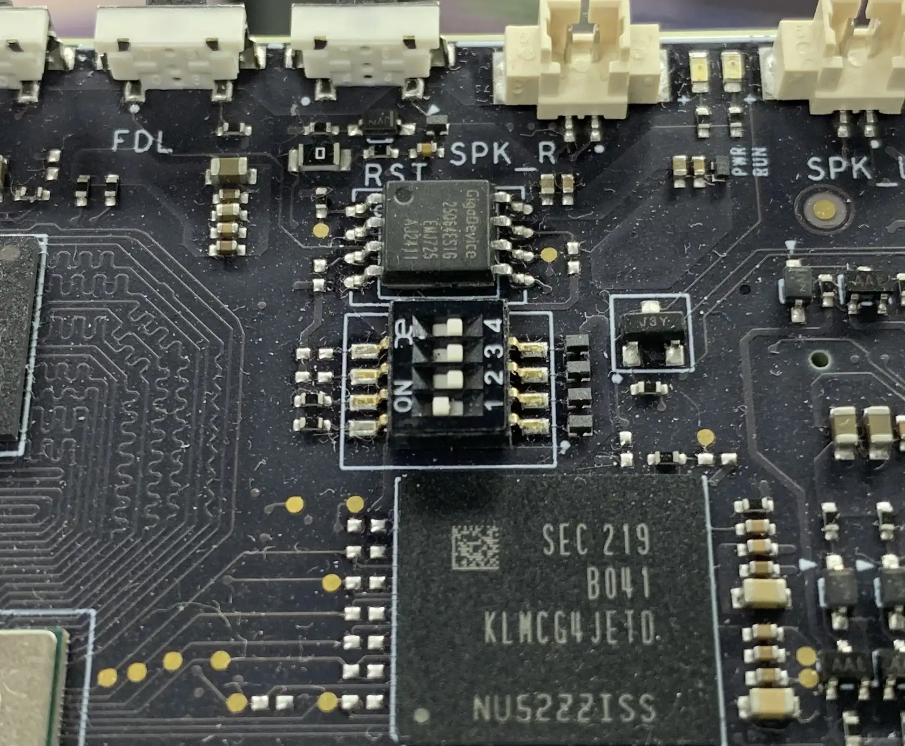

# 在 Spacemit K1/M1 SOC 上部署基于 BOOTSTD 流程的 openEuler RISC-V

主线 U-Boot 近年来发布了一套启动逻辑，用于替换原先基于脚本的 distro-boot 功能，名为 Standard Boot (BootSTD):

[https://docs.u-boot.org/en/stable/develop/bootstd/overview.html](https://docs.u-boot.org/en/stable/develop/bootstd/overview.html)

`BootSTD` 通过对 [BootLoaderSpec](https://www.freedesktop.org/wiki/Specifications/BootLoaderSpec/) 以及 EFI 等协议提供存储自动发现能力，分离固件与操作系统软件，在固件接口方面解决了一部分嵌入式镜像的通用性问题，使得操作系统的启动过程可以完全由配置文件控制，不对固件行为产生依赖，且不用提供平台相关的逻辑。

本镜像在 K1/M1 SDK 基础上使能了 BootSTD 作为启动逻辑。

## 固件升级

### 准备文件

下载文件列表中提供的 `spacemit_k1_fw.tar.zst` ，解压得到下列固件文件：

- `partition.json`
- `bootinfo_spinor.bin`
- `FSBL.bin`
- `fw_dynamic.itb`
- `u-boot.itb`

### 驱动与配置

#### Linux

需要用到 Android SDK Platform Tools 中提供的 fastboot 工具。官方下载地址为：

[https://developer.android.com/tools/releases/platform-tools#downloads.html](https://developer.android.com/tools/releases/platform-tools#downloads.html)

需要配置 udev rules 来解决 USB 设备文件权限问题。执行下述命令完成配置：

```shell
cat << EOF | sudo tee /etc/udev/rules.d/99-spacemit-k1.rules
SUBSYSTEM=="usb", ATTR{idVendor}=="361c", ATTR{idProduct}=="1001", MODE="0660", GROUP="plugdev", TAG+="uaccess"
EOF
```

### 操作流程

操作板卡的启动选择拨码开关，将第一位置 `1` ，使板卡从 SPI NOR Flash 启动：



MUSE Card 没有该开关，默认就是从 Flash 启动。而 BPi-F3 出厂没有焊接 Flash，需要补焊一颗。

将板子的 TYPE-C 口接至电脑。

摁住板子上的 `FDL` 键同时短摁 `RST` 键，将开发板重启进 BootROM。

执行下述命令烧写新的固件：

```shell
fastboot stage FSBL.bin
fastboot continue
sleep 1
fastboot stage u-boot.itb
fastboot continue
sleep 1
fastboot flash mtd partition.json
fastboot flash mtd-bootinfo bootinfo_spinor.bin
fastboot flash mtd-fsbl FSBL.bin
fastboot flash mtd-opensbi fw_dynamic.itb
fastboot flash mtd-uboot u-boot.itb
```

完成后将开发板断开与电脑的连接。

## 系统部署

### SD

执行下述命令将系统镜像烧录至目标设备：

```shell
OERV_VER="24.03-LTS-SP1"
TARGET_DEV="/dev/sdX"
zstdcat "openEuler-${OERV_VER}-base-spacemit_k1-testing.img.zst" | sudo dd of="${TARGET_DEV}" bs=512k conv=sync status=progress iflag=fullblock oflag=direct
```

## 启动

推荐使用独立的 TYPE-C 电源为板卡供电。启动后会自动扩展根分区至整盘大小。
